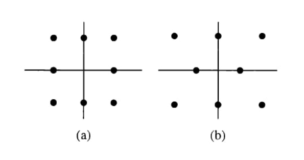
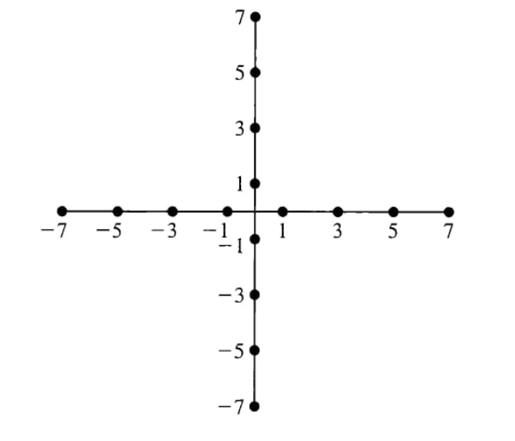

### 1: Average Transmitted Power of 8-QAM Constellations
The figure below shows two different 8-point QAM signal constellations.  
In both cases, the minimum Euclidean distance between adjacent constellation points is equal to \(2A\).

- Determine the **average transmitted power** for each constellation, assuming that all signal points are **equiprobable**.
- Identify **which constellation is more energy-efficient** and justify your answer.

### 2: Gray Coding for 16-QAM
Propose a **Gray code mapping** for the 16-QAM modulation constellation shown in the figure.

### 3: Phase Tree and Trellis Diagram for Partial-Response CPM
Draw:
- the **phase tree**, and  
- the **state trellis diagram**

for a **continuous phase modulation (CPM)** signal with **partial response**, given:
- modulation index $h = \frac{1}{2} $,
- frequency pulse shape  
  $$
  g(t) =
  \begin{cases}
  \frac{1}{4T}, & 0 \le t \le 2T \\
  0, & \text{otherwise}
  \end{cases}
  $$

---

### 4: Power Spectral Density of a QPSK Baseband Signal
Consider a phase-modulated signal represented by the equivalent complex baseband signal:
$$
u(t) = \sum_{n} I_n\, g(t - nT),
$$
where the information symbols $ I_n $ take one of four possible values  
$$
I_n \in \left\{ \frac{\pm 1 \pm j}{2} \right\}
$$
with equal probability. The symbol sequence $ \{I_n\} $ is statistically independent.

#### (a) Rectangular Pulse Shaping
Determine and plot the **power spectral density (PSD)** of $ u(t) $ for the rectangular pulse:
$$
g(t) =
\begin{cases}
A, & 0 \le t \le T \\
0, & \text{otherwise}
\end{cases}
$$

#### (b) Sinusoidal Pulse Shaping
Repeat part (a) for the sinusoidal pulse:
$$
g(t) =
\begin{cases}
A \sin\left( \frac{\pi t}{T} \right), & 0 \le t \le T \\
0, & \text{otherwise}
\end{cases}
$$

#### (c) Spectral Comparison
Compare the spectra obtained in parts (a) and (b), emphasizing bandwidth occupancy and sidelobe behavior.

---

### 5: QAM and MSK Modulation in Python
Implement a **Python class** that performs **QAM** and **MSK** modulation.  
Use a **random binary sequence** as the information source.

Given:
- bit rate: **10 kbps**,  
- signal duration: **0.01 s**.

#### (a) 16-QAM vs. MSK
For **16-QAM** and **MSK** modulations:
- compute the **spectral efficiency**,
- compare the results with each other and with **theoretical values**,
- plot the **power spectral densities** of both modulated signals on the same axes.

#### (b) Comparison of QAM Orders
Repeat part (a) for:
- **4-QAM**,  
- **16-QAM**,  
- **64-QAM**.

Compare their spectral efficiencies and PSD characteristics.
